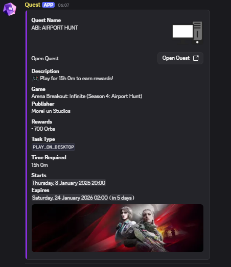

### Overview
A Discord.js bot command that fetches and displays detailed information about Discord quests using Discord's official API. The command supports both direct Quest IDs and full Discord quest URLs.

### Features
- **Dual Input Support**: Accepts both quest IDs (e.g., `1459263468677894241`) and full URLs (e.g., `https://discord.com/quests/1459263468677894241`)
- **Customizable Embeds**: 25 different color options for embed customization
- **Flexible Delivery**: Send quest information to any text or announcement channel
- **User Mention Options**: Option to mention @everyone, @here, or no mention
- **Thumbnail Selection**: Choose between default thumbnails (based on task type) or quest logotype
- **Comprehensive Quest Data**: Displays all quest information including status, rewards, timestamps, and progress

### Installation
1. **Prerequisites**:
   - Node.js 16.9.0 or higher
   - Discord.js v14 or higher
   - A Discord bot token

2. **Setup**:
   ```bash
   # Clone the repository
   git clone https://github.com/yourusername/discord-quest-bot.git
   
   # Navigate to the project directory
   cd discord-quest-bot
   
   # Install dependencies
   npm install discord.js
   ```
   


3. **Configuration**:
   Create a `config.js` file in the root directory:
   ```javascript
   module.exports = {
       tokenme: 'YOUR_DISCORD_USER_TOKEN_HERE'
   };
   ```

### Command Usage
```
/getquest id:<quest_id_or_url> [color:<hex_color>] [channel:<#channel>] [mention:<type>] [thumbnail:<source>]
```

#### Parameters:
- **id**: (Required) Quest ID or full Discord quest URL
- **color**: (Optional) Embed color from predefined choices
- **channel**: (Optional) Target channel for sending quest info
- **mention**: (Optional) Mention type: @everyone, @here, or none
- **thumbnail**: (Optional) Thumbnail source: default or node

#### Examples:
```
/getquest id:1459263468677894241
/getquest id:https://discord.com/quests/1459263468677894241 color:#ff0000
/getquest id:1459263468677894241 channel:#quests mention:@everyone
```

### API Integration
The bot uses two Discord API endpoints:
1. `GET https://discord.com/api/v9/quests/{questId}` - Quest configuration
2. `GET https://discord.com/api/v9/quests/{questId}/user-status` - User progress

### File Structure
```
discord-quest-bot/
├── commands/
│   └── quest/
│       └── getquest.js
├── config.js
├── package.json
└── README.md
```

### Security Notes
- **Administrator Only**: The command requires administrator permissions
- **Token Security**: Keep your Discord token secure and never commit it to public repositories
- **Rate Limiting**: Built-in 15-second cooldown to prevent API abuse

### Troubleshooting
- **Quest Not Found**: Ensure the quest ID is correct and the quest is active
- **API Errors**: Verify your Discord token is valid and has necessary permissions
- **Channel Permissions**: Ensure the bot has send permissions in the target channel


### نظرة عامة
أمر بوت ديسكورد يعمل بـ Discord.js لجلب وعرض معلومات مفصلة عن كويستات ديسكورد باستخدام واجهة برمجة تطبيقات ديسكورد الرسمية. يدعم الأمر كلاً من معرفات الكويست المباشرة وروابط الكويست الكاملة.

### المميزات
- **دعم الإدخال المزدوج**: يقبل كلاً من معرفات الكويست (مثال: `1459263468677894241`) والروابط الكاملة (مثال: `https://discord.com/quests/1459263468677894241`)
- **تضمين قابل للتخصيص**: 25 خيار لون مختلف لتخصيص التضمين
- **إرسال مرن**: إرسال معلومات الكويست إلى أي قناة نصية أو إعلانية
- **خيارات ذكر المستخدمين**: خيار لذكر @everyone، @here، أو عدم ذكر أحد
- **اختيار الصورة المصغرة**: اختر بين الصور المصغرة الافتراضية (بناءً على نوع المهمة) أو شعار الكويست
- **بيانات كويست شاملة**: يعرض جميع معلومات الكويست بما في ذلك الحالة، المكافآت، الطوابع الزمنية، والتقدم

### التثبيت
1. **المتطلبات الأساسية**:
   - Node.js 16.9.0 أو أعلى
   - Discord.js الإصدار 14 أو أعلى
   - رمز بوت ديسكورد

2. **الإعداد**:
   ```bash
   # استنساخ المستودع
   git clone https://github.com/yourusername/discord-quest-bot.git
   
   # الانتقال إلى دليل المشروع
   cd discord-quest-bot
   
   # تثبيت التبعيات
   npm install discord.js
   ```

3. **التكوين**:
   إنشاء ملف `config.js` في الدليل الرئيسي:
   ```javascript
   module.exports = {
       tokenme: 'YOUR_DISCORD_USER_TOKEN_HERE'
   };
   ```

### استخدام الأمر
```
/getquest id:<معرف_الكويست_أو_الرابط> [color:<لون_سداسي>] [channel:<#القناة>] [mention:<نوع>] [thumbnail:<مصدر>]
```

#### المعلمات:
- **id**: (مطلوب) معرف الكويست أو رابط الكويست الكامل في ديسكورد
- **color**: (اختياري) لون التضمين من الخيارات المحددة مسبقاً
- **channel**: (اختياري) القناة المستهدفة لإرسال معلومات الكويست
- **mention**: (اختياري) نوع الذكر: @everyone، @here، أو none
- **thumbnail**: (اختياري) مصدر الصورة المصغرة: default أو node

#### أمثلة:
```
/getquest id:1459263468677894241
/getquest id:https://discord.com/quests/1459263468677894241 color:#ff0000
/getquest id:1459263468677894241 channel:#quests mention:@everyone
```

### تكامل واجهة برمجة التطبيقات
يستخدم البوت نقطتي نهاية من واجهة برمجة تطبيقات ديسكورد:
1. `GET https://discord.com/api/v9/quests/{questId}` - تكوين الكويست
2. `GET https://discord.com/api/v9/quests/{questId}/user-status` - تقدم المستخدم

### هيكل الملفات
```
discord-quest-bot/
├── commands/
│   └── quest/
│       └── getquest.js
├── config.js
├── package.json
└── README.md
```

### ملاحظات الأمان
- **للمسؤولين فقط**: الأمر يتطلب صلاحيات المسؤول
- **أمان الرمز**: احتفظ برمز ديسكورد الخاص بك آمناً ولا ترفعه أبداً إلى مستودعات عامة
- **تحديد المعدل**: مهلة مدمجة مدتها 15 ثانية لمنع إساءة استخدام واجهة برمجة التطبيقات

### استكشاف الأخطاء وإصلاحها
- **الكويست غير موجود**: تأكد من صحة معرف الكويست وأن الكويست نشط
- **أخطاء واجهة برمجة التطبيقات**: تحقق من صحة رمز ديسكورد الخاص بك وامتلاكه للصلاحيات اللازمة
- **صلاحيات القناة**: تأكد من أن البوت لديه صلاحيات الإرسال في القناة المستهدفة
